<picture>
  <source media="(prefers-color-scheme: dark)" srcset="dark.svg">
  <source media="(prefers-color-scheme: light)" srcset="light.svg">
  
</picture>

### 👋 A bit about me

I'm a Data Science graduate student (M.Tech, SRM University AP) working across data analytics, data governance, and full-stack development. I like building things end-to-end — from REST APIs and cloud-deployed backends to CNN pipelines and real-time voice/LLM systems.

- 🔭 Currently building **ProjectFlow** — a collaborative task management platform (FastAPI, PostgreSQL, React)
- 🌱 Also exploring real-time conversational AI (ASR–LLM–TTS pipelines) and semantic search
- 💬 Ask me about Python, SQL, FastAPI, Power BI, or data governance
- 📫 Reach me at **dhadwalnitin912@gmail.com**

 

## 🛠️ Tech Stack

**Languages**

**Backend & APIs**

**Frontend**

**Data, ML & Analytics**

**Cloud & Tools**

 

## 💼 Experience

**Data Science Intern** — Evigway Technologies Pvt Ltd `May 2025 – Jul 2025`
Built an end-to-end CNN pipeline for crop classification on multi-spectral satellite imagery; processed 50+ GB of geospatial data and improved validation IoU by 12%.

**Project Intern** — IBM `Jun 2023 – Aug 2023`
Built a cloud-native mobile app platform with 10+ REST API endpoints, Agile workflow, and CI/CD deployment that cut release turnaround by 20%.

**Data Analyst Intern** — NameKart `Aug 2022 – Jan 2023`
Analyzed 100k+ records with SQL and built Power BI dashboards tracking 20+ KPIs, reducing manual reporting effort by 40%.

 

## 📌 Featured Projects

- **[ProjectFlow](https://github.com/Pali912)** — Collaborative task management platform with 20+ REST endpoints (FastAPI, SQLAlchemy, PostgreSQL), JWT auth, and a React frontend, containerized with Docker.
- **Real-Time Conversational AI Voice Agent** — Modular ASR–LLM–TTS pipeline (Faster-Whisper, Ollama LLM, TTS) with streaming audio and multi-turn memory for low-latency voice conversations.
- **Adaptive Japanese Vocabulary Learning System** — Semantic-similarity-based answer checking with a FastAPI backend, adaptive review logic, and real-time multiplayer via Firebase.
- **Amazon Product Review Sentiment Analysis** — NLP sentiment classification and trend visualization across 200k+ product reviews.

 

## 📜 Certifications

- Google Data Analytics Professional Certificate — *Google*
- AWS Certified Academic Graduate — *Amazon Web Services*
- Data Engineering Certificate — *DeepLearning.AI*
- Power BI: Data Security, Governance & Workspace Management — *Whizlabs*

 

## 📫 Connect

